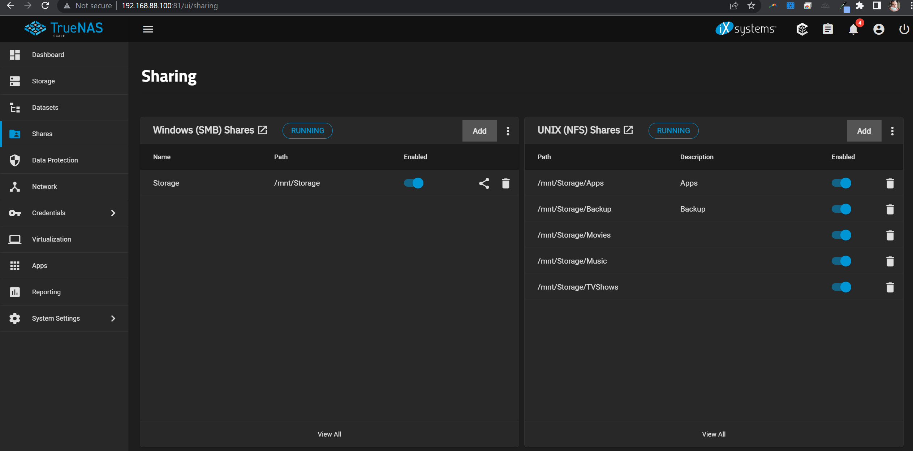
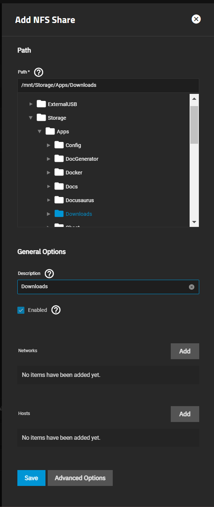
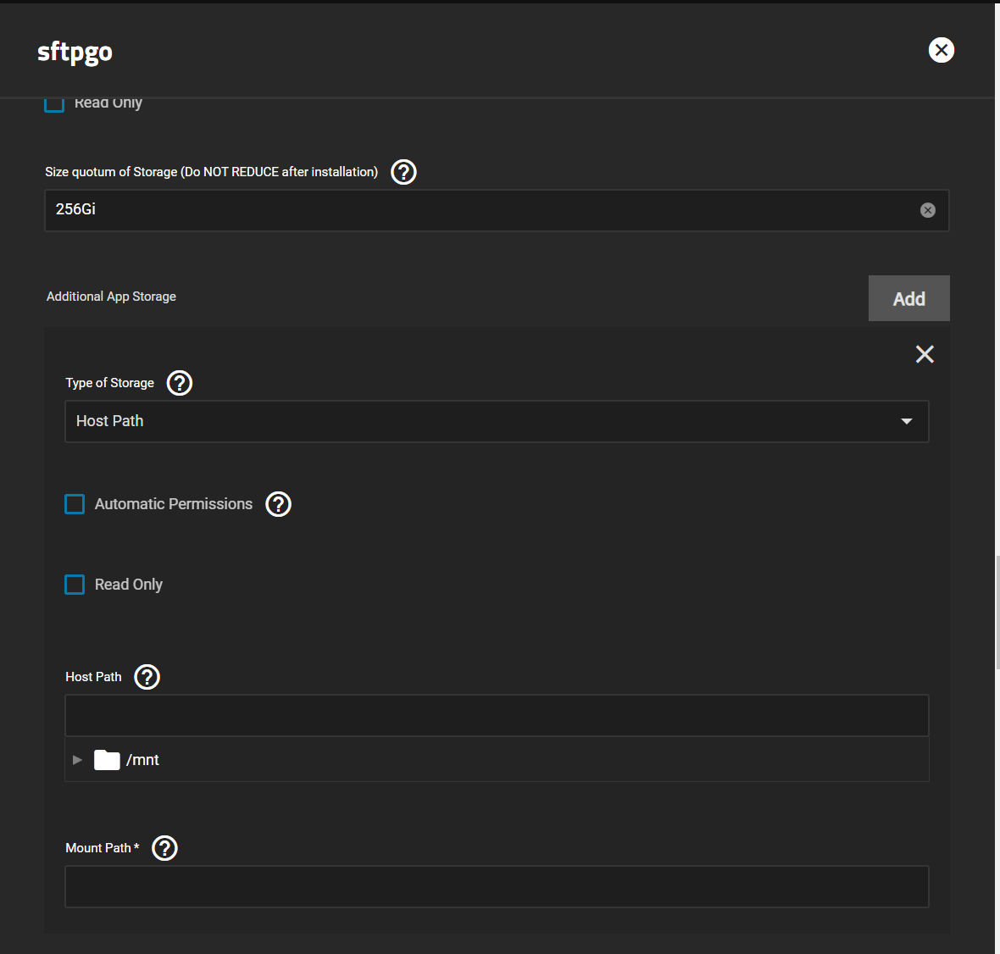
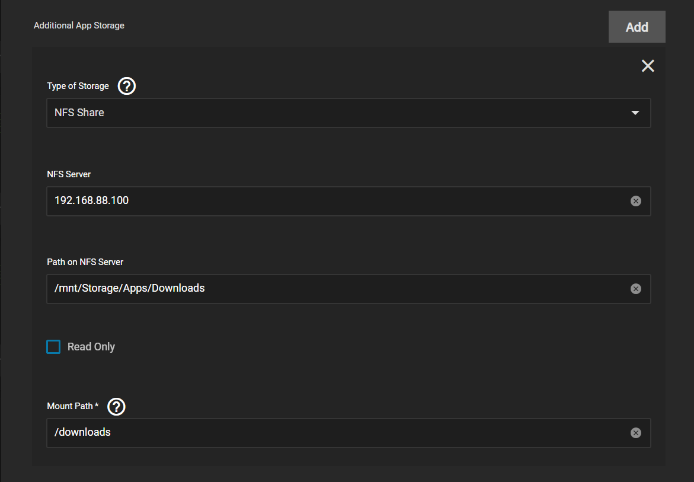
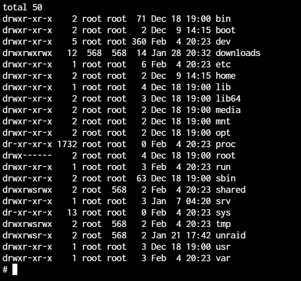

With the recent changes to TrueNAS SCALE 22.12 concerning HostPath validation (read our [news](/news/hostpath-validation) or our [adding storage](/scale/guides/add-storage) pages to learn more) the one way to add media storage is to mount NFS Shares to your `TrueCharts` applications. This process involves two parts, and this guide will demonstrate each step to create `NFS Shares` in SCALE and then add them in the `Storage` section of `TrueCharts` apps. This won't work with the official catalog applications. As well, one can use NFS shares and SMB shares on the same dataset, but only NFS shares are mounted by TrueCharts applications.

:::caution[Application Databases / Configs on NFS Shares]

NFS Shares are meant to storing your file/media shares in case they need to be share with other users or computers. This is not meant for the entire application. Our recommended approach and default for most applications is PVC storage (read more [here](/general/faq#why-pvc-is-recommended-over-hostpath)). There is known cases of database corruption with NFS Shares and sqlite so you are warned.

:::

## Part 1 - Create NFS Shares in SCALE

In the main SCALE GUI, select the `Shares` item on the menu bar and you'll read this page.

Click on `Add` inside the `UNIX (NFS) Shares` section.

- Select the dataset or folder that contains your media library, description is optional but helps, and then click `Save`
  choose the Save option.

- Repeat as necessary for different folders or datasets you wish to share, and make sure you note the paths of each `NFS Share`, as you will need to enter those later.

## Part 2 - Add NFS Shares to Applications

Next you're going to add `NFS Storage` to your applications. This can be in the `media` or `downloads` storage for certain apps or `Additional App Storage` for others (such as the example below). **We do no recommend installing the entire app to NFS Shares as that can corrupt any databases inside the app.** This is meant for media or file storage only.

- Select `Add` next to `Additional Add Storage`

- Change to `NFS Share` in the `Type of Storage` dropdown

- Enter info for your `NFS Share` as below, for this example we'll use the `Downloads` share we created above.
  - The NFS Server can be `localhost` or your `SCALE IP`, I keep `SCALE IP`.
  - `Path on NFS Server` has to match your `NFS Shares` path, as above I had _mnt/Storage/Apps/Downloads/_
  - `Mount Path*` is the container path, I simply put `/downloads`

- Continue entering info as any regular app and click `Save`.

And that's it, to verify depending on the app you can use the `App Shell` such as the example below or the GUI inside the web interface of your app.

