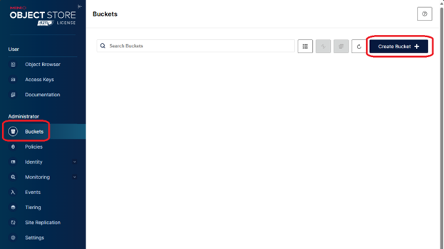
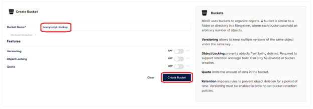
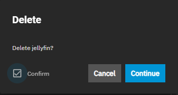
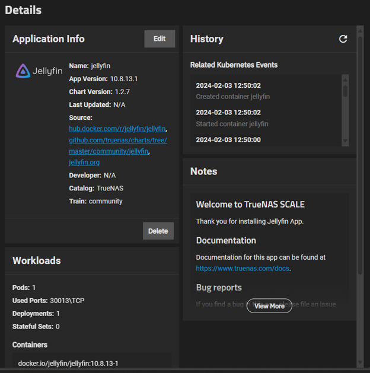

# Velero Backup and Restore

This guide was written for TrueNAS Cobia 23.10.1 and HeavyScript v2.9.0.

This is an EARLY prototype of a new backup method to-be-released before TrueNAS SCALE DragonFish 24.04 comes out.
It should not be relied uppon for production or as a primary backup method.

## Minio Setup

Use the TrueNAS IXSystems Minio chart.
These instructions are for the Minio chart from the `charts` train, not the `premium` train.
In a later revision of this guide we will replace this with an external hosted s3 solution

* Application Name
  - Application Name - minio
* Workload Configuration - Default
* Minio Configuration
  - Root User – choose an administrator username
  - Root Password – choose a password
  - Enable Host Path for Minio Data Volume – checked
    - Choose a location to store the bucket data in.
* Advanced DNS – Default

Click install

After the install and deployment is complete, login with the admin user.

Click Buckets and Create Bucket.


Name the bucket heavyscript-backup and click create bucket.


## Velero Setup

Use the Velero chart from Truecharts.

- Application Name
  - Application Name – velero
- General Settings – Default
- App Configuration
  - Backup Storage Locations – Add
    - Name – default
    - accessMode – ReadWrite
    - bucket – truenas-backup
    - Provider – **s3**
    - Storage Location Credential – **s3**
      - Id – admin username
      - Key – admin password
    - Storage Location Config
      - Region – minio
      - S3ForcePathStyle – true
      - S3Url – http://192.168.0.2:9000 (Replace with your TrueNAS IP)

**Volume Snapshot Location is not finished for now**
  - Volume Snapshot Locations – Add
    - Name – default
    - Provider – **openebs.io/zfspv-blockstore**
    - Storage Location Credential – **s3**
      - Id – admin username
      - Key – admin password
    - Storage Location Config
      - Provider – **s3**
      - bucket – truenas-backup
      - Region – minio
      - S3ForcePathStyle – true
      - S3Url – http://192.168.0.2:9000 (Replace with your TrueNAS IP)

## Velero CLI Setup

The Velero CLI is used to trigger manual backups and restores.
No GUI or UI to see here! Use HeavyScript to install Velero (Option 3, Option 4)

## App Backup Schedule Setup

On each App you want to backup-up, there is a "Backup Schedule" section.

  - Backup Schedule – Add
    - Name – *The Name you want to use for the backups of things app, must be unique*
    - schedule - 0 0 * * *

## Backing Up

Command to configure a backup of an app (example is Jellyfin) and create a schedule to run the backup every day at midnight.

```
export KUBECONFIG=/etc/rancher/k3s/k3s.yaml
velero backup create --from-schedule NameOfYourBackupSchedule
```

Double check that your backup is completed.

```
export KUBECONFIG=/etc/rancher/k3s/k3s.yaml
velero backup get NameOfYourBackupSchedule
```

Look for Status Completed in the output.


## Test Disaster Recovery

Now cause a simulated disaster of losing Jellyfin by deleting the app from the TrueNAS UI.


To restore:

```
export KUBECONFIG=/etc/rancher/k3s/k3s.yaml
velero restore create --from-backup NameOfYourBackupSchedule
```

### Post Restore

Velero gives us a command to check the status of our restoration. Let’s run that. We get all kinds of interesting info about the restore but importantly we see that the restore was successful and is completed.
![Velero Restore(./img/velero-restore.png)

To ensure the restore does not encounter weird issues in the future, we recommend using `edit` on the App in question and saving without changes, as soon as the restore is fully complected.

Once the Phase: Completed (green text) appears, check the status from the TrueNAS webUI. Looks like the app is back up and running.

