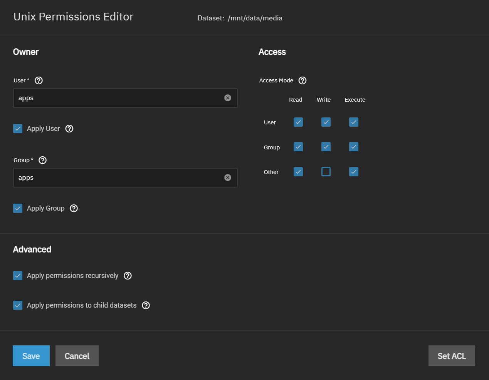
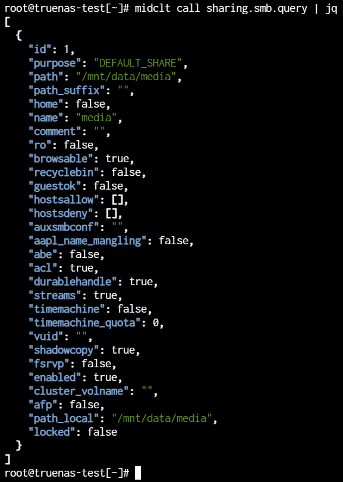
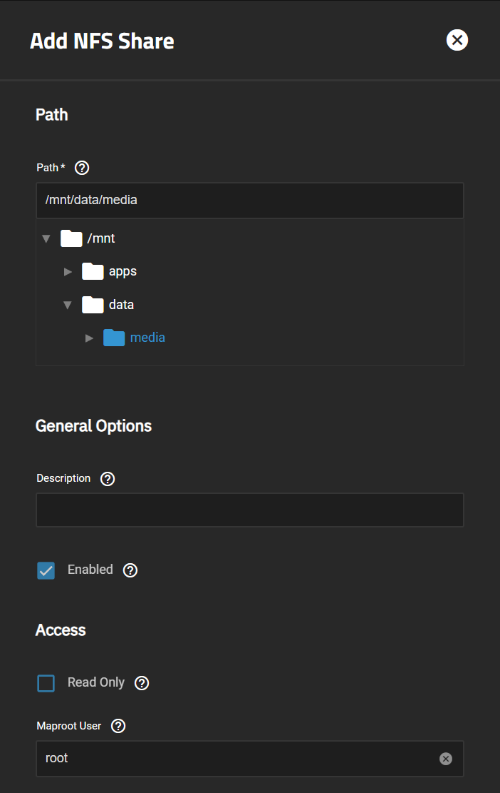
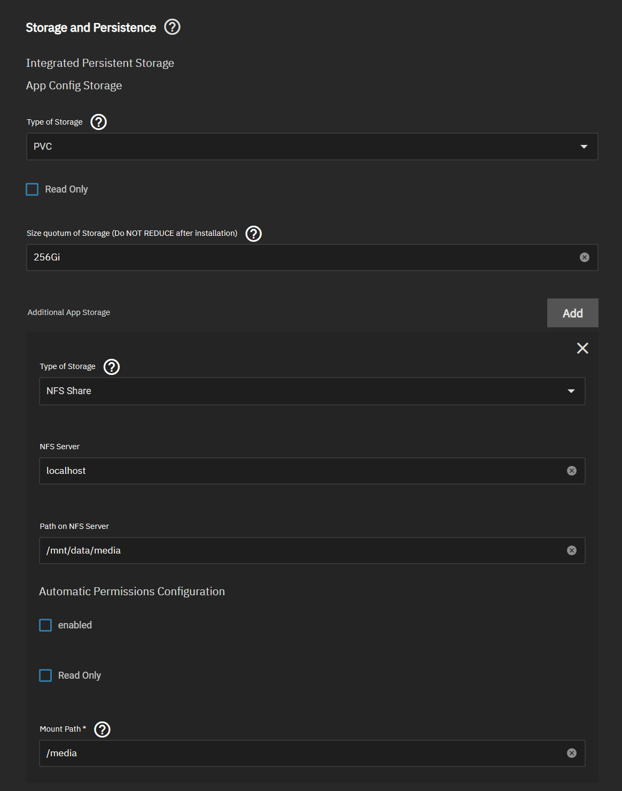

This guide provides the recommended setup for dataset permissions, shares and application data storage.

## Dataset Permissions

TrueCharts applications are designed to use the `apps` (568) user for data permissions. Configure your dataset permissions as shown below to allows applications access.

:::info ACL

If your existing dataset shows `Edit ACL` then you need to `Strip ACL` before continuing.

:::



## SMB Access

For SMB access you will need to create a user(s) that are members of the `apps` group and modify the default SMB settings.

### SMB User

Create a user and assign it to the `apps` group under `Auxiliary Groups` as shown below.


### SMB Share

Create an SMB Share as shown below. All settings should remain default.

:::warning ACL

After saving SMB settings TrueNAS Scale will ask if you want to `Configure ACL`. Do **NOT** as this will overwrite the previously configured permissions. You can select `Cancel`, SMB Share will still be configured.

:::


#### Setup SMB Share Auxiliary Parameters

With the release of Cobia the `Auxiliary Parameters` has been removed from the WebUI. The below will guide you through the use of API calls and the system shell to add the correct parameters.

Open System Shell

Enter the following command:

```bash
midclt call sharing.smb.query | jq
```



Take note of the id(s) you wish to setup.

Enter the following command, make sure to replace `<id>` with the id from above.

```bash
midclt call sharing.smb.update <id> '{"auxsmbconf": "force user = apps\nforce group = apps"}'
```

The output should include the following if it was done correctly:


Repeat for any additional SMB Shares.

## NFS Share

Create an NFS Share which will be used for applications to access the dataset. Configure an NFS Share as shown below. You will need to click `Advanced Options` to set `Maproot User` to `root`.



## App Storage

For most applications data access will be configured under `Additional App Storage`.

:::caution APP CONFIG STORAGE

NFS should **NOT** be used for `App Config Storage`. This should be left on the default of PVC.

:::

Configure `Additional App Storage` as shown below. In some applications data storage is part of the application configuration, in those cases you would still configure NFS but not need to setup a `Mount Path`.


