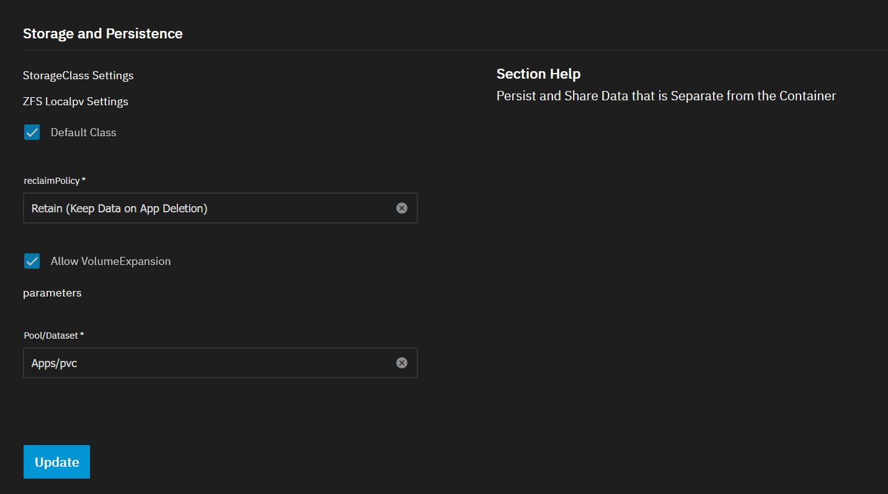

:::caution DragonFish is not yet supported

This is a pre-release guide, TrueNAS SCALE 24.04 DragonFish is explicitly **NOT** yet supported by TrueCharts

:::

## Important Changes

iX-Systems no longer maintains or supports any form of PVC-based storage for apps. This includes their own "legacy" storage backend. This means that when using the following SCALE features, you will lose some functionality:

**SCALE Backup and Restore (unreleased feature available through HeavyScript)**

_Will no longer back up storage at all._

**SCALE Rollback**

_You will no longer be able to roll back any storage._

**SCALE App pool migration**

_You will no longer be able to migrate storage using the pool migration feature in SCALE._

The above issues exist both for our new in-house TrueCharts OpenEBS storage solution **and** for users using already installed apps that use the legacy storage backend from iX-Systems.

## For existing Users and Apps

### Post-DragonFish Upgrade Steps

Once you have completed updating your SCALE system to DragonFish, enter the following command in the TrueNAS SCALE shell ensuring it's ran as root and as shown below:

`rm /mnt/tank/ix-applications/k3s/server/manifests/zfs-operator.yaml`

_Replace `tank` in the command above with the name of your Apps-pool_

and

`k3s kubectl delete -f https://truecharts.org/openebsrem.yaml`

and

`k3s kubectl delete storageClass openebs-zfspv-default`

Continue with the steps under "For new Users and Apps freshly installed on DragonFish"

After installing the `OpenEBS` App, run the following:

`sudo curl -s https://truecharts.org/openebsmv.sh | bash`

### For new Users and Apps freshly installed on DragonFish

Once you have completed the above steps, you need to install the `OpenEBS` app from the TrueCharts Operator train as below. This app contains our own version of PVC storage.
**Existing users: Ensure to not the name of the app when installing**

- In the SCALE GUI, go to Apps -> Discover Apps -> Manage Catalogs
- Ensure you have `system` in the list of Preferred Trains in the TRUECHARTS row as below. If so, skip the next step

- If you don't already, you can add it by selecting the TRUECHARTS row and selecting the `Edit` button and selecting `system` under the "Preferred Trains" dropdown list as below

Then install the `OpenEBS` chart

![OpenEBS Icon(./img/OpenEBS.png)

Please ensure you've chosen a **Pool/Dataset** that's not inside `ix-applications` and do not include `/mnt/` in front of the pool/dataset, as shown below

It's important to set the `pool/dataset` to the dataset you want to store the folders with the application data in them.

:::danger

When setting the `pool/dataset` as above, do **not** set the path to the existing ix-applications dataset

:::

### Migrating to new storage

We highly advise moving to the new storage backend for existing Apps as well. _At a later date we will update this with migration instructions as well._
Until we have migration steps ready, existing apps will continue to work like normal.
